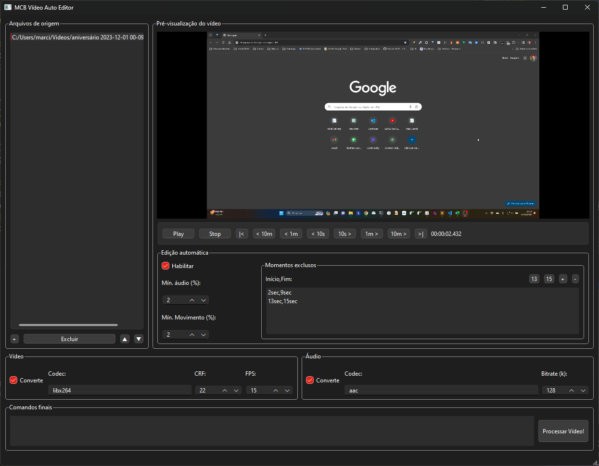

# MCB-VIDEO-UTILS

Wrapper made in Python for automatic editing (using auto-editor) and joining (using ffmpeg) of video

## What's done:

- Automatic video editing with parameters
- Video joining and conversion using ffmpeg
- Video preview
- Handling segments excluded from editing

## What remains to be finished:

- Include more auto-editor options
- Include more ffmpeg options

## Challenges:

- Dismiss the use of the command line to use auto-editor and ffmpeg libraries directly
- Compatibility with Windows 7